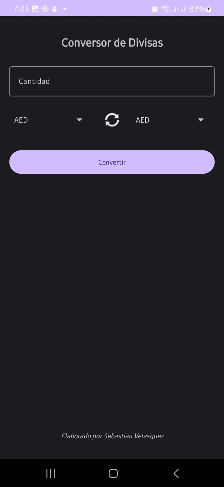
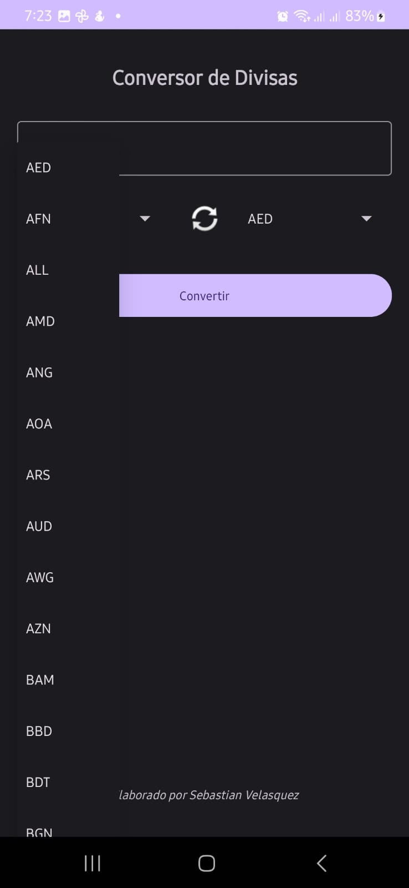
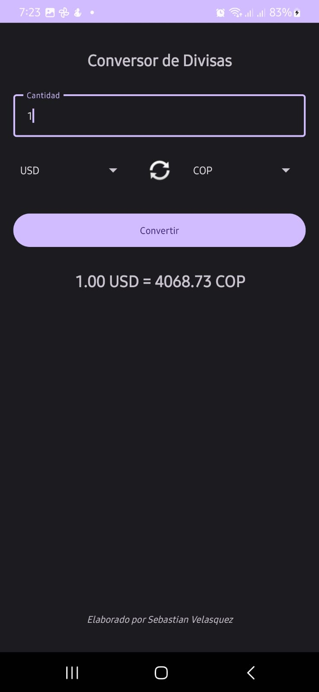
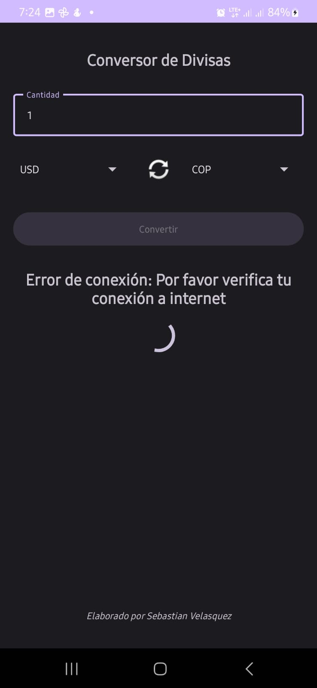
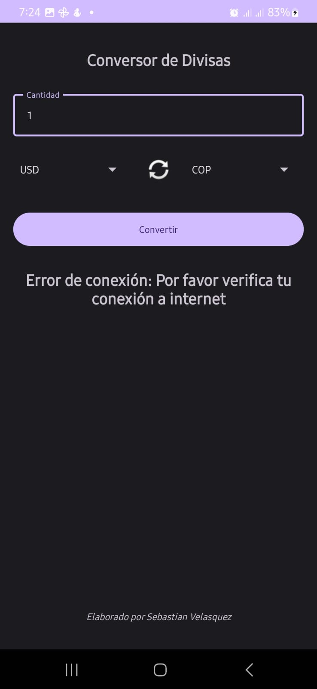

# Documentación Técnica - Conversor de Divisas

## Capturas de Pantalla de la Aplicación

### Pantalla Principal

*La interfaz principal muestra un diseño limpio y organizado con todos los elementos necesarios para la conversión de divisas.*

### Proceso de Selección de Moneda

*Los usuarios pueden seleccionar fácilmente entre una amplia variedad de monedas disponibles.*

### Resultado de la Conversión

*El resultado se muestra claramente con el formato: [cantidad original] [moneda origen] = [cantidad convertida] [moneda destino].*

### Estado de Carga

*Durante la conversión, se muestra un indicador de carga para informar al usuario que la operación está en proceso.*

### Manejo de Errores

*La aplicación muestra mensajes de error claros cuando hay problemas de conexión u otros errores.*

## Estructura del Proyecto

La aplicación está organizada en los siguientes componentes principales:

### 1. Interfaz de Usuario (MainActivity y Layout)

#### Layout Principal (activity_main.xml)
```xml
<!-- Título de la aplicación -->
<TextView
    android:id="@+id/titleTextView"
    android:layout_width="match_parent"
    android:layout_height="wrap_content"
    android:text="Conversor de Divisas"
    android:textSize="24sp"
    android:textStyle="bold"
    android:gravity="center"/>
```
Este fragmento define el título principal de la aplicación que aparece en la parte superior, como se muestra en la captura de la pantalla principal.

```xml
<!-- Campo de entrada para la cantidad -->
<com.google.android.material.textfield.TextInputLayout
    android:id="@+id/amountInputLayout"
    android:layout_width="match_parent"
    android:layout_height="wrap_content"
    android:hint="Cantidad">
    <com.google.android.material.textfield.TextInputEditText
        android:id="@+id/amountEditText"
        android:layout_width="match_parent"
        android:layout_height="wrap_content"
        android:inputType="numberDecimal" />
</com.google.android.material.textfield.TextInputLayout>
```
Este componente permite al usuario ingresar la cantidad a convertir, como se ve en la captura de la pantalla principal.

### 2. Lógica de Negocio (CurrencyViewModel)

#### Inicialización de la API
```kotlin
private val api: ExchangeRateApi = Retrofit.Builder()
    .baseUrl("https://v6.exchangerate-api.com/")
    .addConverterFactory(GsonConverterFactory.create())
    .build()
    .create(ExchangeRateApi::class.java)
```
Este código configura Retrofit para realizar las llamadas a la API de tasas de cambio.

#### Función de Conversión
```kotlin
fun convertCurrency(amount: Double, fromCurrency: String, toCurrency: String) {
    viewModelScope.launch {
        _isLoading.value = true
        try {
            val response = api.getExchangeRates(fromCurrency)
            val rate = response.conversion_rates[toCurrency] 
                ?: throw Exception("Tasa de cambio no encontrada")
            val result = amount * rate
            _conversionResult.value = String.format("%.2f %s = %.2f %s", 
                amount, fromCurrency, result, toCurrency)
        } catch (e: IOException) {
            _conversionResult.value = "Error de conexión: Por favor verifica tu conexión a internet"
        } finally {
            _isLoading.value = false
        }
    }
}
```
Esta función realiza la conversión de divisas, como se muestra en la captura del resultado de conversión.

### 3. Comunicación con la API (ExchangeRateApi)

#### Definición de la API
```kotlin
interface ExchangeRateApi {
    @GET("v6/26410a8913d0dc1fc254ba46/latest/{base}")
    suspend fun getExchangeRates(@Path("base") baseCurrency: String): ExchangeRateResponse
}
```
Define el endpoint para obtener las tasas de cambio, usando tu API key específica.

### 4. Modelo de Datos (ExchangeRateResponse)

```kotlin
data class ExchangeRateResponse(
    val result: String,
    val base_code: String,
    val conversion_rates: Map<String, Double>
)
```
Esta clase modela la respuesta de la API, conteniendo:
- Estado de la respuesta
- Código de la moneda base
- Mapa de tasas de conversión

### 5. Manejo de Eventos de Usuario (MainActivity)

#### Configuración de Observadores
```kotlin
private fun setupObservers() {
    viewModel.availableCurrencies.observe(this) { currencies ->
        val adapter = ArrayAdapter(this, 
            android.R.layout.simple_spinner_dropdown_item, currencies)
        binding.fromCurrencySpinner.adapter = adapter
        binding.toCurrencySpinner.adapter = adapter
    }

    viewModel.conversionResult.observe(this) { result ->
        binding.resultTextView.text = result
    }

    viewModel.isLoading.observe(this) { isLoading ->
        binding.progressBar.visibility = if (isLoading) View.VISIBLE else View.GONE
        binding.convertButton.isEnabled = !isLoading
    }
}
```
Este código maneja la actualización de la UI, como se ve en las capturas de selección de moneda y estado de carga.

## Flujo de la Aplicación

1. **Inicio**:
   - La aplicación carga y muestra la interfaz principal (ver captura de pantalla principal)
   - Se cargan las monedas disponibles desde la API

2. **Interacción del Usuario**:
   - El usuario ingresa una cantidad
   - Selecciona las monedas (ver captura de selección de moneda)
   - Puede intercambiar las monedas con el botón de swap

3. **Proceso de Conversión**:
   - Se muestra el indicador de carga (ver captura de estado de carga)
   - Se procesa la conversión
   - Se muestra el resultado (ver captura de resultado de conversión)

4. **Manejo de Errores**:
   - Se muestran mensajes claros al usuario (ver captura de manejo de errores)

## Notas Técnicas

- La aplicación utiliza el patrón MVVM (Model-View-ViewModel)
- Se implementa View Binding para una interacción segura con la UI
- Se utilizan Corrutinas para operaciones asíncronas
- La interfaz sigue los principios de Material Design
- Se incluye manejo de errores robusto
- La aplicación es responsive y se adapta a diferentes tamaños de pantalla

## Créditos
Desarrollado por Sebastian Velasquez 